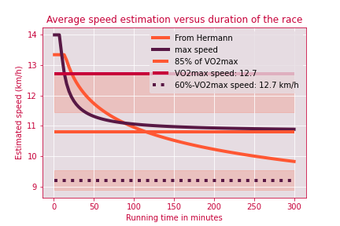

The aim of this package is dedicated to planify running or triathlon long races.

[Contact](mailto:gt@guydegnol.net)

#### 💗 Athlete

This section summarizes physiological constraints. 
Only the weights might be updated once in a while

#### 🌍 Race

This section let you the choice between:
1. Use a known format for a race (ironman,  marathon, ...). 
Average slopes can be configured manualy.

2. Use a known race. Mostly french races for now.
Gpx track quality might be poor. Shoud be nice to better filter them.

3. Have a fully personalized race. Discipline can be added.

##### Temperature

Temperature is an important parameter to simulate the dehydration.
By default (automatic mode), it is using the date and place of the race.
For all cases, **it is filtered by typical intraday** to replicate best its estimations.

#### 🏊🚴🏃 Performances

It is what you think you can perform on that distance.
**The estimated speed will take into account the relief and temperatures parameters.**

#### 🏆Simulation

The final estimation and nutrition plans need for the accomplishement of the race
#### 💦 Training (beta mode ⚠️🚧)

Should contains the training plan to get to that objective.
