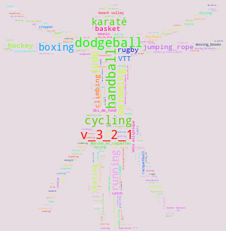

# Trianer: an app for TRIAthlon/Running, acting as a basic traiNER

### 🛠️The aim of the app is to help you to planify your race:
- 💗 Athlete can personalize their basic physiological constraints.
- 🌍 Races formats and well-known races (mostly french races) are directly available.
- 🏊🚴🏃 Performances has to be filled by the athlete (**might be automatic if linked to another sport app**). Heights differences and expected temperatures are also taken into account.
- 🏆 It will finally generate an ideal nutrition plan to accomplish your race.
- 💦 Training (beta mode ⚠️🚧) Should contains the training plan to get to that objective.

### 📚 **Documentation of the app is available here [wiki](https://github.com/guydegnol/trianer/wiki) (📧 [contact](mailto:trianer@guydegnol.net))**.

> ⚠️ This package used to be deployed on heroku (pure web app). It has now to be installed localy to be tested.

💡 Different sports according to calories spent

